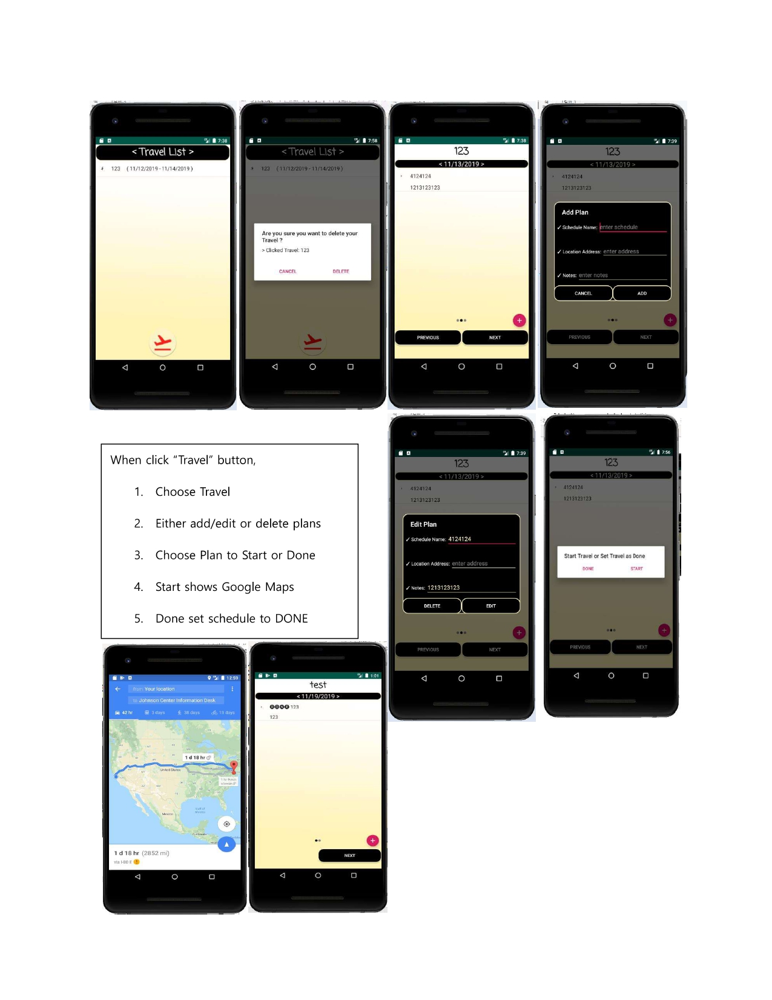
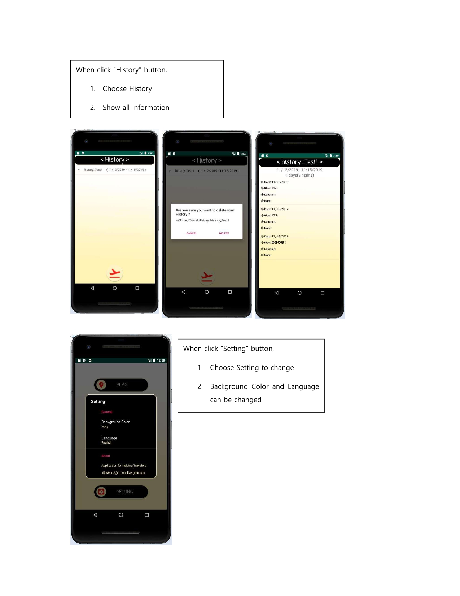

# 🏖 IF Travel THEN Plan (ITTP) 🏖

- Travel Planner Application
> [ITTP.apk DOWNLOAD](https://downgit.github.io/#/home?url=https://github.com/kdh4646/IF_Travel_THEN_Plan_ITTP/blob/main/ITTP.apk)
> <a href="https://downgit.github.io/#/home?url=https://github.com/kdh4646/IF_Travel_THEN_Plan_ITTP/blob/main/ITTP.apk"></a>

<div>
  <picture>
    
  </picture>
  
  <picture>
    
  </picture>
</div>

# 🚀 Introduction

- When people plan for travel, they need to use multiple applications such as calendar
to add schedule, map to find the way to the destination and so on. Instead of turning
on multiple applications, combining useful functions into one application to help
travelers more comfortable. Application’s name is “ITTP (IF: Travel THEN: Plan)”.

# 📖 Project details

**I. Application Icon**
  - Red Airplane picture with background color of Ivory.

**II. Welcome Screen**
  - 3 seconds of welcome screen with Application Logo.

**III. Main Screen**
  - Plan button: user makes a new travel plan.
  - Travel button: user starts a travel plan that user chosen.
  - History button: user can see the history of finished travel.
  - Setting button: user can either change the background color of Application or language and vibration mode.

**IV. Plan button**
  1. User asked to enter the title. (Title should be unique, no duplicate)
  2. Choose the Start Date.
  3. Choose the End Date. (End Date only allows before or same with the
  Start Date)
  4. Plan page appears with each date. User can go back/forward with the
  buttons to change date and able to add/edit/delete plans.
  5. After finish planning go back to Main Screen.
  
**V. Travel button**
  1. Track the lists of travel that user made.
  2. On Click, saved travel plans data popped up and user can fix data or
  start the plan.
  3. When “START” button is clicked, GPS opens based on location address
  that user entered, and after finishing the plan, user can set plan to
  “DONE” status.
  4. After finishing all plans, travel deleted from the travel list and go to the
  history list.
  
**VI. History button**
  1. User can see finished travels.
  2. It shows all information of selected history. For example, when, where,
  specific notes and whether that plan was finished or not.
  
**VII.Setting button**
  1. User can change the background color. (Ivory: default, Red, Green and
  Blue)
  2. User can change the language. (English: default and Korean)

# 🏆 System Components
  - [AndroidManifest.xml](AndroidManifest.xml)
    – It contains multiple activities for application and permissions for GPS.

  - Activities (java)
    - [AddPlanListActivity](java/gmu/edu/cs477/ittp/AddPlanListActivity.java) - activity for adding or editing plans.
    - [DatabaseOpenHelper](java/gmu/edu/cs477/ittp/DatabaseOpenHelper.java) – database helper class.
    - [HistoryActivity](java/gmu/edu/cs477/ittp/HistoryActivity.java) – activity for showing history.
    - [MainActivity](java/gmu/edu/cs477/ittp/MainActivity.java) – activity for main screen.
    - [PlanCalendarActivity](java/gmu/edu/cs477/ittp/PlanCalendarActivity.java) – activity for calendar activity.
    - [PlanMakeActivity](java/gmu/edu/cs477/ittp/PlanMakeActivity.java) – activity for managing plans.
    - [PlanTitleActivity](java/gmu/edu/cs477/ittp/PlanTitleActivity.java) – activity for making title.
    - [SettingActivity](java/gmu/edu/cs477/ittp/SettingActivity.java) – activity for settings.
    - [TravelActivity](java/gmu/edu/cs477/ittp/TravelActivity.java) – activity for showing travel lists.
    - [TravelEditActivity](java/gmu/edu/cs477/ittp/TravelEditActivity.java) – activity for editing travel.
    - [TravelLoadingActivity](java/gmu/edu/cs477/ittp/TravelLoadingActivity.java) – activity for loading saved travel.
    - [WelcomeActivity](java/gmu/edu/cs477/ittp/WelcomeActivity.java) – activity for welcome screen.
    - [Drawable](res/drawable) - including graphics for application icon, buttons icon and so on.
    - [Layout](res/layout) - supporting all activities with portrait/landscape mode. Used linearlayouts and constraintlayout.
    - [Values](res/values) -settings preference array values, colors and styles. Also button backgrounds are included.
    - [Xml](res/xml) - settings preference xml file.
    - [Build.gradle (Module: app)](build.gradle) - added material for floating action button and Google GPS.

# ✨ Story Board
  > [!NOTE]
  > Below Story Boards are ONLY showing Portarit Mode. (Landsacpe Mode is also available)

  <p align="center">
    
    
    
  </p>

# 🎉 Summary
  - Project is mainly used
    <kbd>
      Database
    </kbd>
    ,
    <kbd>
      GPS
    </kbd>
    ,
    <kbd>
      Calendar
    </kbd>
    ,
    <kbd>
      Cursor
    </kbd>
    ,
    <kbd>
      ListView
    </kbd>
    ,
    <kbd>
      Floating Action Button
    </kbd>
    .
- Created setting options, which include changing background color and languages.
- Opt for Google Maps, which offers user-friendly functions like locating the fastest route and suggesting alternative methods to reach users' destination.

# 🪄 LICENSE

```
Copyright 2019 Do Hyung Kweon

Licensed under the Apache License, Version 2.0 (the "License");
you may not use this file except in compliance with the License.
You may obtain a copy of the License at

    http://www.apache.org/licenses/LICENSE-2.0

Unless required by applicable law or agreed to in writing, software
distributed under the License is distributed on an "AS IS" BASIS,
WITHOUT WARRANTIES OR CONDITIONS OF ANY KIND, either express or implied.
See the License for the specific language governing permissions and
limitations under the License.
```
